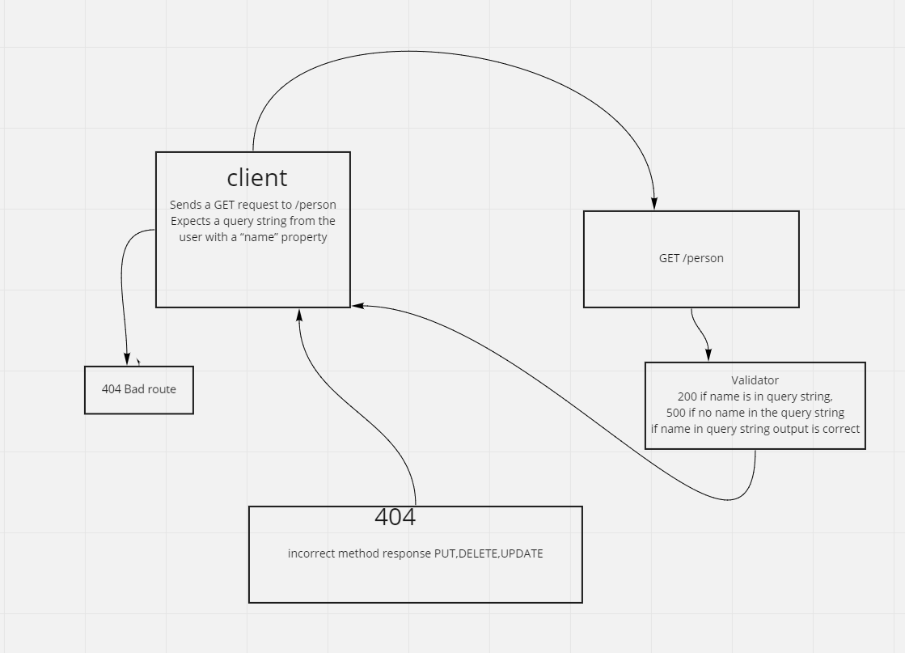

# basic-express-server
standards compliant Express server

# UML

## Installation

to install run `git clone `

`cd`

run `npm install`

## Usage

To start server run : `npm start`

To test server run: `npm test`

## Routes
/person